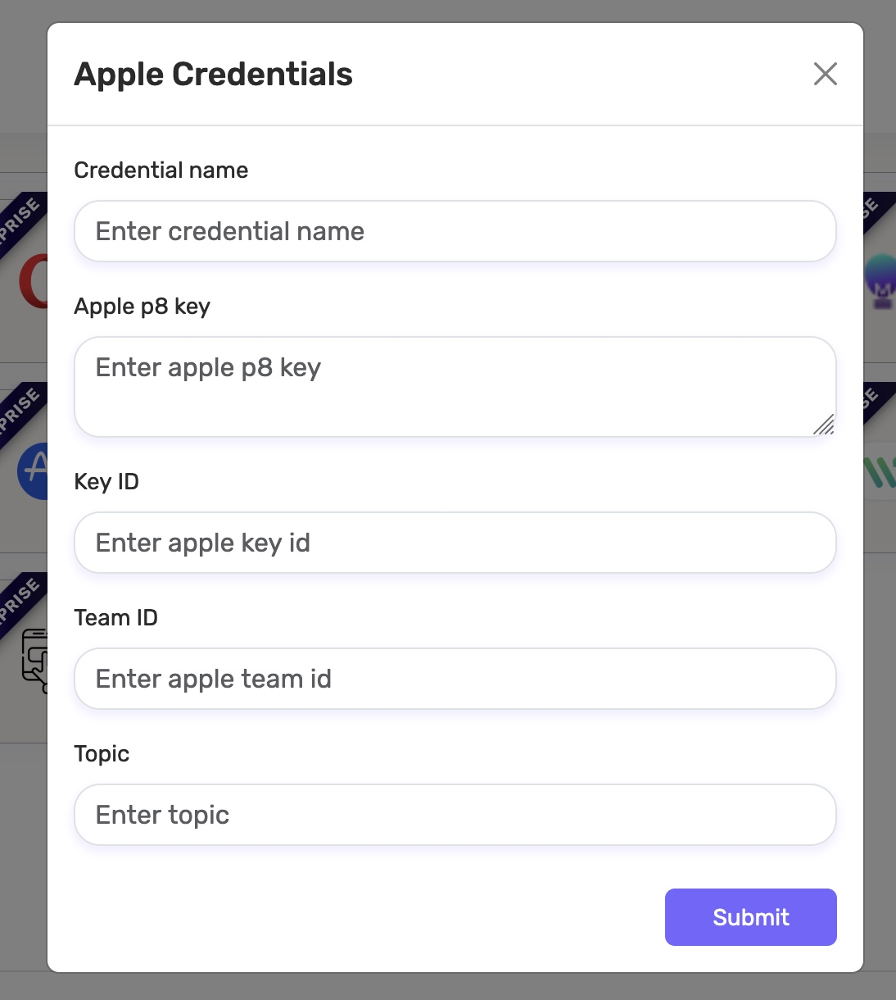

#  Mok SDK

 [](https://swift.org/)
 [](https://developer.apple.com/)
 [](LICENSE.txt)

Welcome to the integration guide for Mok SDK. This document provides step-by-step instructions on integrating Mok SDK into Xcode projects.
Mok is a customer engagement platform for websites and mobile apps. It offers an integrated suite for simplifying notifications for engineering and product management. To use Mok SDK, we need to initialize it with the project environment, read key, and write key. This initialization process is crucial for authorization and ensuring that the SDK functions correctly within the project.

1. [Prerequisites](https://github.com/unotag/unomok-sdk-ios?tab=readme-ov-file#prerequisites)
2. [Installation](https://github.com/unotag/unomok-sdk-ios?tab=readme-ov-file#installations)
    - [Cocoapods](https://github.com/unotag/unomok-sdk-ios?tab=readme-ov-file#cocoapods)
    - [Swift Package Manager](https://github.com/unotag/unomok-sdk-ios?tab=readme-ov-file#swift-package-manager)
    - [Carthage](https://github.com/unotag/unomok-sdk-ios?tab=readme-ov-file#carthage)
    - [Manually](https://github.com/unotag/unomok-sdk-ios?tab=readme-ov-file#manually)
3. [Initialization](https://github.com/unotag/unomok-sdk-ios?tab=readme-ov-file#initialization)
4. [Usage](https://github.com/unotag/unomok-sdk-ios?tab=readme-ov-file#usage)
    - [Logging User-Specific Event](https://github.com/unotag/unomok-sdk-ios?tab=readme-ov-file#logging-user-specific-event)
    - [Push Notification](https://github.com/unotag/unomok-sdk-ios?tab=readme-ov-file#push-notification)
        - [Firebase](https://github.com/unotag/unomok-sdk-ios?tab=readme-ov-file#firebase)
        - [APNs](https://github.com/unotag/unomok-sdk-ios?tab=readme-ov-file#apns)
    - [Automated Identification](https://github.com/unotag/unomok-sdk-ios?tab=readme-ov-file#automated-identification)
    - [Device Details Fetching](https://github.com/unotag/unomok-sdk-ios?tab=readme-ov-file#device-details-fetching)
    - [In-app Messages and Popups](https://github.com/unotag/unomok-sdk-ios?tab=readme-ov-file#in-app-messages-and-popups)
    - [In-app Carousel Views](https://github.com/unotag/unomok-sdk-ios?tab=readme-ov-file#in-app-carousel-views)
    - [Onboarding Views](https://github.com/unotag/unomok-sdk-ios?tab=readme-ov-file#onboarding-views)

## Prerequisites
- iOS 16.0 or later
- Xcode 14 and later
- Swift 5.0
- Mok SDK Read and Write keys

## Installations

### Cocoapods

CocoaPods is a dependency manager for Cocoa projects. To incorporate Mok into the Xcode project using CocoaPods, include the specification in your Podfile. Please refer to their official website for detailed instructions on usage and installation.
[incomplete: need to distribute the SDK via cocoapods]

### Swift Package Manager

The Swift Package Manager is a tool for managing the distribution of Swift code. It’s integrated with the Swift build system to automate the process of downloading, compiling, and linking dependencies.
[incomplete: need to distribute the SDK via SPM]

### Carthage

Carthage is a decentralized iOS dependency manager using Git, emphasizing dynamic frameworks without the lock file and providing manual integration into Xcode projects.
[incomplete: need to distribute the SDK via Carthage]

### Manually

If you choose not to use the above mentioned dependency managers, you have another option - manually integrate the Mok SDK into your project.

1. Download the latest version of Mok XCFramework (include a link to the xcframework)
2. Drag and Drop the XCFramework file into your Xcode project's file navigator.
3. Embed & Sign the XCFramework:
    1. Select your app's target in Xcode.
    2. Navigate to the General tab.
    3. In the Frameworks, Libraries, and Embedded Content section, choose Embed & Sign for the Unomok.xcframework.

    

Your manual integration is now complete. Ensure that XCFramework is included in the project and embedded in the app target.

## Initialization

1. In your AppDelegate, import the SDK:

```swift
import Unomok
```

2. Initialize the SDK using the project environment, SDK Read Key, and SDK Write Key.

```swift
let _ = MokSDK(isProductionEnv: "BOOL_OF_PROJECT_ENVIRONMENT",   sdkReadKey:"YOUR_SDK_READ_KEY", sdkWriteKey: "YOUR_SDK_WRITE_KEY")
```
Here's the information presented in a Markdown table format:

| Parameter                     | Description                                                          |
| --------------------------------- | -------------------------------------------------------------------- |
| `BOOL_OF_PROJECT_ENVIRONMENT`      | A boolean value that indicates the project environment. If the environment is production, use `true`; otherwise, use `false`. |
| `READ_KEY`                        | The SDK read key provided by Mok for authentication and configuration. |
| `WRITE_KEY`                       | The SDK write key provided by Mok for authentication and configuration. |

3. Update user ID after initialization of SDK. 

```swift
MokSDK.updateUser(userID: "USER_ID", withParameters: "PARAMETERS"){ sucessMessage, error in

}
```

Here's the information presented in a Markdown table format:

| Parameter Name  | Description                                                           |
| --------------- | --------------------------------------------------------------------- |
| `USER_ID`        | The user ID of the current user or device.                            |
| `parameters`     | Any additional data related to the event in `[String: Any]` format.   |

For example, if you need to send a user ID along with a name, it can be sent as:

```swift
MokSDK.updateUser(userID: "USER_ID", withParameters: [
  "name": "John Doe"
]) { sucessMessage, error in

}
```

## Usage

### Logging User-Specific Event

Mok SDK can log user-specific events with the specified name and additional parameters.

```swift
MokSDK.logEvent(userID: userId, eventName: eventName, parameters: params) { [self] (successMessage, error) in
}
```

Here's the information presented in a Markdown table format:

| Parameter Name  | Description                                                           |
| --------------- | --------------------------------------------------------------------- |
| `userID`        | The user ID of the current user or device.                            |
| `eventName`     | The name of the current event that needs to be logged.                |
| `parameters`    | Any additional data related to the event in `[String: Any]` format.   |

### Push Notification

Mok SDK provides seamless integration for handling push notifications, allowing you to engage users through both [Apple Push Notification Service (APNs)](https://developer.apple.com/documentation/usernotifications/registering_your_app_with_apns) and [Firebase Cloud Messaging (FCM)](https://firebase.google.com/docs/cloud-messaging). 

Setting up push notifications in an iOS app involves several steps, and it requires configuring both your app and the Apple Developer account. Below is a step-by-step guide for setting up push notifications in an iOS app using Swift:

1. Create an App ID on Apple Developer Portal.

    - Go to the [Apple Developer Portal](https://idmsa.apple.com/IDMSWebAuth/signin?appIdKey=891bd3417a7776362562d2197f89480a8547b108fd934911bcbea0110d07f757&path=%2Faccount%2F&rv=1).
    - Select `Identifiers` and then create a new App ID.
    - Make sure to enable `Push Notifications` in the App ID settings.
    
2. Create an APNs Key

    - In the [Apple Developer Portal](https://idmsa.apple.com/IDMSWebAuth/signin?appIdKey=891bd3417a7776362562d2197f89480a8547b108fd934911bcbea0110d07f757&path=%2Faccount%2F&rv=1), navigate to Keys and create a new key.
    - Enable the Apple Push Notifications service (APNs) option.
    
3. Configure Your Xcode Project

    - Open your Xcode project.
    - Under the `Signing & Capabilities` tab, ensure that your app has a unique bundle identifier matching the one you registered in the Apple Developer Portal.
    - Enable the `Push Notifications` and `Background Modes` capabilities in Xcode.
    
4. Handle Device Token

Implement the method to handle the device token when it's received.

```swift
func application(_ application: UIApplication, didRegisterForRemoteNotificationsWithDeviceToken deviceToken: Data) { MokSDK.registerDeviceTokenForRemoteNotification(deviceToken: deviceToken) { token, message, errorMessage  in
  }
} 
```

`registerDeviceTokenForRemoteNotification` will register the `deviceToken` to MokSDK

Here's the information presented in a Markdown table format:

| Property Name   | Description                                                                                   |
| --------------- | --------------------------------------------------------------------------------------------- |
| `token`         | Holds the FCM token generated if the push notification type is FCM.                          |
| `message`       | Holds the success message in string if the push notification type is APNs.                     |
| `errorMessage`  | Error message in string.                                                                       |
5. Request User Permission and Register for Remote Notifications

The registerForRemoteNotification() method of MokSDK will request user permission to receive push notifications and automatically register for remote notifications. Therefore, there is no need to implement requestAuthorization of UNUserNotificationCenter and UIApplication's registerForRemoteNotifications() method.
If you are using Firebase, use (1); otherwise, use (2).

```swift
MokSDK.registerForRemoteNotification(type: .fcm) // (1)

MokSDK.registerForRemoteNotification() // (2)
```

6. Implement the Delegate methods
Implement the `UNUserNotificationCenterDelegate` methods to handle notifications.

```swift
UNUserNotificationCenter.current().delegate = self

extension AppDelegate : UNUserNotificationCenterDelegate {
    func userNotificationCenter(_ center: UNUserNotificationCenter, willPresent notification: UNNotification, withCompletionHandler completionHandler: @escaping (UNNotificationPresentationOptions) -> Void) {
        let userInfo = notification.request.content.userInfo
        print(userInfo)
        completionHandler([[.banner, .sound]])
    }
    
    func userNotificationCenter(_ center: UNUserNotificationCenter, didReceive response: UNNotificationResponse, withCompletionHandler completionHandler: @escaping () -> Void) {
        if let userInfo = response.notification.request.content.userInfo as? [String: Any] {
            print(userInfo)
        }
        completionHandler()
    }
}
```

#### Firebase

1. **Add Firebase to your Apple project:**

If you haven't already, [add Firebase to your Apple project](https://firebase.google.com/docs/ios/setup).

2. **Upload your APNs authentication key:**

Upload your APNs authentication key to Firebase. If you don't already have an APNs authentication key, make sure to create one in the [Apple Developer Portal](https://idmsa.apple.com/IDMSWebAuth/signin?appIdKey=891bd3417a7776362562d2197f89480a8547b108fd934911bcbea0110d07f757&path=%2Faccount%2F&rv=1).

    1. Open Firebase Console. Navigate to your project. Inside your project, select the settings icon, select Project Settings, and then select the Cloud Messaging tab.
    2. In APNs Authentication Key section under Apple app configuration, click the Upload button.
    3. Browse to the location where you saved your p8 key, select it, and click Open. Add the key ID and Team ID for the key (available in the Apple Developer Portal) and click Upload.         
#### APNs

For APNs, you have to upload the APNs authentication key to [Mok Dashboard](https://dev.mok.one/).
 
1. Go to the Channels tab under the Notifications section.
2. Select option Apple and add your Apple Credentials there. 
3. You have to add the Credential name, p8 key, Key ID, Team ID and Topic there. Topic is the same as the bundle identifier.

 
 
 ### Automated Identification
 
Mok automatically identifies views with unique accessibility labels. When integrating the SDK and capturing a screen, all such elements will automatically appear in the Mok dashboard. These elements are utilized for element-specific in-app notifications, such as spotlight and tooltip. Automated identification is exclusively used to identify views on a screen, enabling the configuration of UI element-specific in-app notifications and displaying carousel views based on these identified elements. This feature operates only in development mode on iOS (not in the App Store). Its functionality depends on the value of **isProductionEnv**, which is passed during the initialization of the Mok SDK. The format for adding an accessibility label for automated identification begins with **PL_iOS**. For example, if there is a UILabel that needs automatic identification, you can name it as **PL_iOS_Name_Label**. No additional implementation is required; the SDK automatically manages it. 

### Device Details Fetching

On initialization, this SDK automatically fetches the device details. No additional implementation is needed; the SDK handles it automatically. The collected device details include:

| Device Information      | Description                                   |
| ------------------------ | --------------------------------------------- |
| Device Model            | The model of the device.                      |
| System Version          | The version of the operating system.          |
| Device Name             | The name assigned to the device.              |
| UDID                    | The Unique Device Identifier.                 |
| Device Type             | The type or category of the device.           |
| Screen Size             | The physical size of the device screen.       |
| Device Orientation      | The current orientation of the device.        |
| Total Physical Memory   | The total physical memory available on the device. |
| Battery State           | The current state of the device's battery.    |
| Battery Level           | The current level of the device's battery.   |
| Screen Brightness       | The current brightness level of the device screen. |
| Language                | The language setting of the device.           |
| Country                 | The country setting of the device.            |
| TimeZone                | The time zone setting of the device.          |
| Internet Status         | The current status of the device's internet connection. |

### In-app Messages and Popups

Mok can be used for displaying in-app notifications. You can configure different types of in-app notifications such as: pop-ups, tooltips, spotlight etc.

1. Fetching In-App Notifications

When fetching in-app notifications, the in-app notifications are stored in a local SQLite storage. The method used for fetching the in-app notifications is:

```swift
MokSDK.fetchInappNotifications(userID: userId) { inAppMessageList, error in
}
```

2. Displaying In-App Notifications

The method for displaying all pending in-app notification is:

```swift
 MokSDK.loadAllPendingPopups()
```
This method will fetch all in-app notifications from the local database and display them based on the type of the notification.

3. Removing In-App Notifications

To remove all in-app notifications, use the following method:

```swift
MokSDK.removeAllInappData()
```

Usually, in-app notifications are automatically removed from the database once displayed. The above method can be used for any additional implementation.

### In-app Carousel Views

With Mok SDK, you can effortlessly display carousel views that are configured through the dashboard. 

1. Fetching Carousel View Contents

On fetching carousel views, the carousel contents are stored in a local SQLite storage. To fetch all the carousel views, use the following method:

```swift
MokSDK.fetchAllCarouselContents { carousalArray, error in
  
}
```

2. Displaying all Carousel Views

The method for displaying all carousel views is:

```swift
MokSDK.showCarouselViews { _ in
 
}
```

This method will fetch all carousel view contents from the local database.

3. Remove all carousel content

To remove all carousel contents stored in local storage, use the following method:

```swift
MokSDK.removeAllCarouselData { _ in

}
```

### Onboarding Views

With Mok SDK,  you can display onboarding views that are configured through the dashboard. 

1. Fetching All Onboarding View Contents

To fetch all onboarding  view contents use the following method:

```swift
 MokSDK.fetchAllOnboardingScreenContents { contentsArray, error in

}
```

2. Displaying Onboarding Views

The following method will display all the onboarding views:

```swift
MokSDK.showOnboardingScreen()
```


